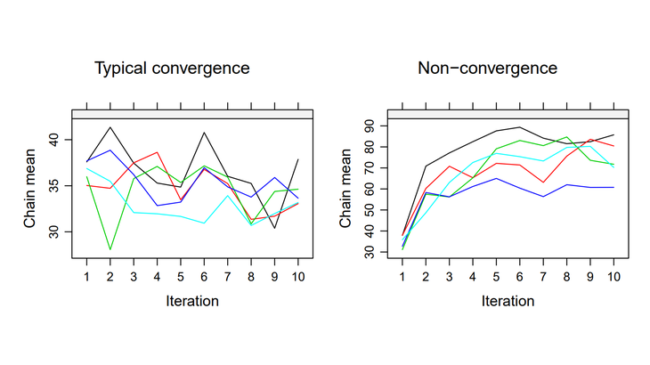
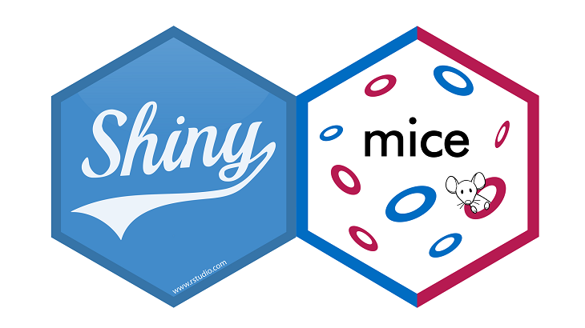

# Hi, I'm Hanne!

A statistician interested in data visualization, interdisciplinarity, and open science. Follow me on [Twitter](https://twitter.com/hioberman) if you want to get to know me and my terrible sense of academia/programming humor.

## Experience

Currently, I'm working as a lecturer and research associate at Utrecht University's Methodology and Statistics department. 

For 50% of my appointment I get to teach and supervise students, mostly in topics related to [Applied Data Science](https://www.uu.nl/en/research/applied-data-science). The other half of my appointment is research time. I'm involved in the [Missing Data](https://www.uu.nl/en/organisation/methodology-and-statistics/missing-data) group led by [Stef van Buuren](https://stefvanbuuren.name/) and [Gerko Vink](https://www.gerkovink.com/), and I assist projects guided by [Thomas Debray](https://thomasdebray.be/) at the [Julius Center for Health Sciences and Primary Care](https://juliuscentrum.umcutrecht.nl/en/). 

If you'd like to know more about my former education, check out my [LinkedIn profile](https://www.linkedin.com/in/hanneoberman/) or [CV](https://github.com/hanneoberman/CV/blob/master/HanneObermanCV.pdf).

If you'd like to see my programming skills live in action, browse around through my [GitHub repositories](https://github.com/hanneoberman).

## Research

I aspire to adhere to the open science principles, and post all of my ongoing work on [GitHub](https://github.com/hanneoberman). 

For an overview of my published work, see my [ORCiD page](https://orcid.org/0000-0003-3276-2141). Other places to find my research output are my [university page](https://www.uu.nl/staff/HIOberman) and [Google Scholar](https://scholar.google.nl/citations?user=myLQXrEAAAAJ).

Some examples of my work:

- My MSc thesis [Missing the Point: Non-Convergence in Iterative Imputation Algorithms](https://openreview.net/pdf?id=fHSVg6mVqpw).

- My ongoing project [{shinymice}](https://hanneoberman.shinyapps.io/shinymice-demo/), an online evaluation suite for missing data (demo version). 

